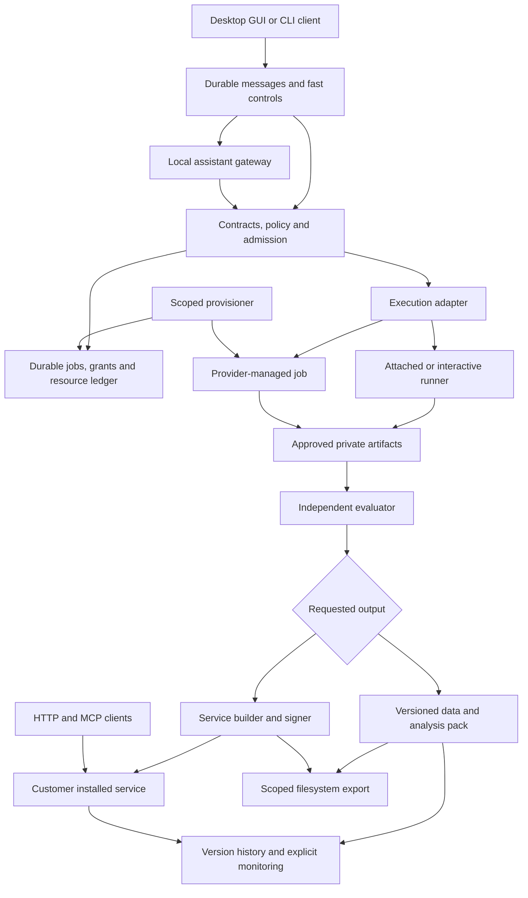
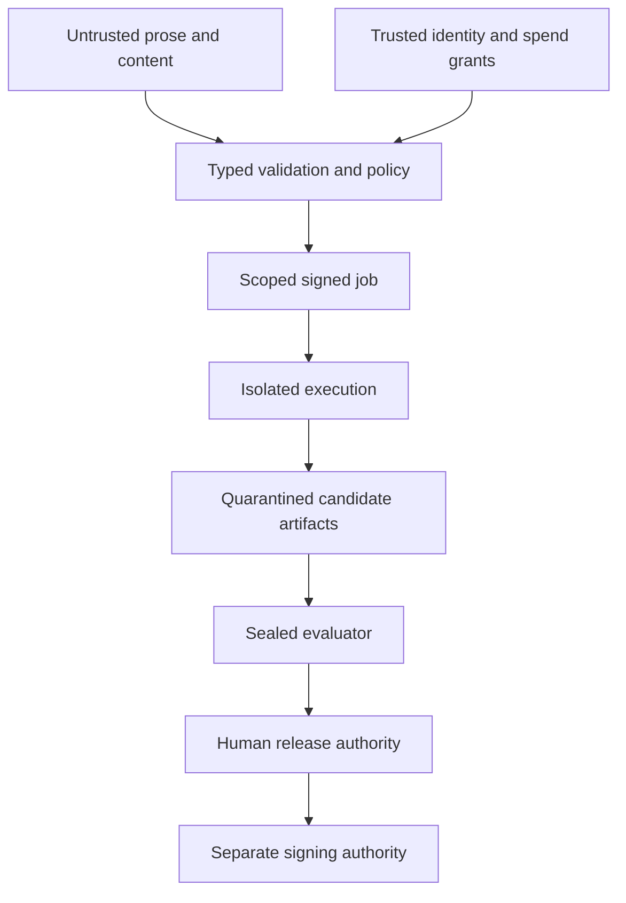
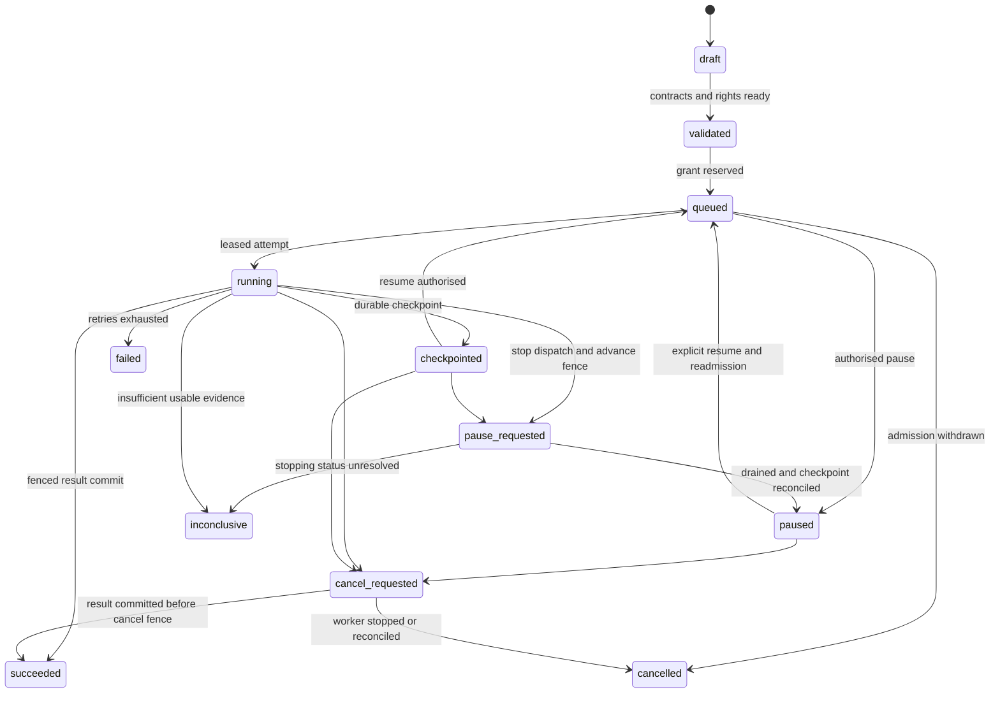
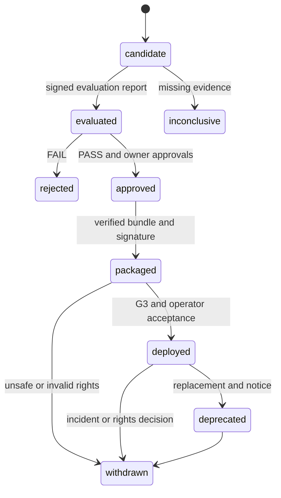
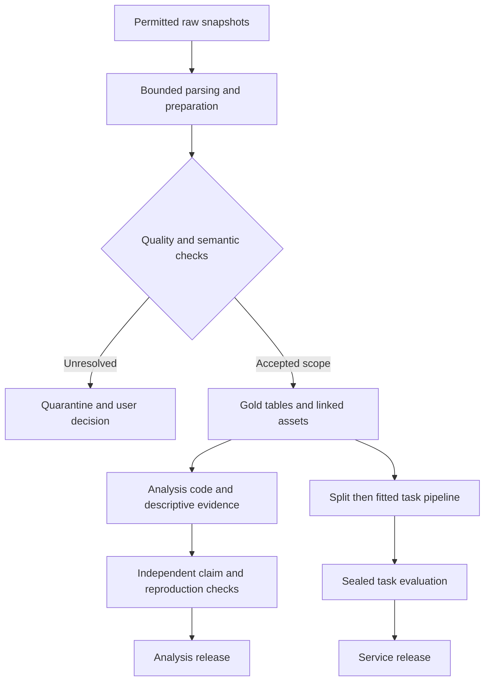
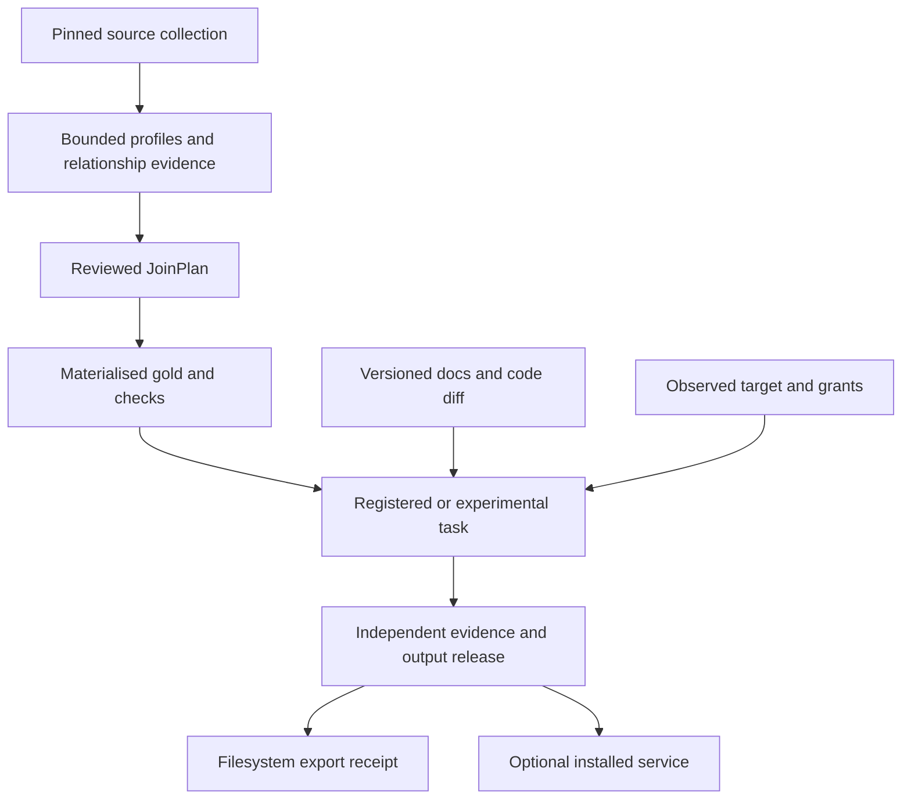

# Architecture: policy, portable execution and independent serving

Planning edition **0.7.0** · 29 September 2026. Architecture and delivery proposals are unimplemented; upstream facts retain their own verification dates. No compute is provisioned or purchased by this plan.

The GUI-native desktop starts a per-user local harness. The architecture separates conversational intent/control, assistant inference, multi-dataset relationship planning and multi-format preparation, task execution, compute lifecycle, independent checking and optional installed serving. A provider is an implementation behind declared capabilities; tenancy, evaluation policy and budget authority remain in the application boundary.

## System context and minimal topology

Use one modular Python application, deployable locally or on a qualified durable customer/platform host. Its domain logic is independent of notebook, HTTP, MCP and provider wrappers. The same admission path is used by the first local implementation and later external executors. Process/credential separation follows trust boundaries; logical modules are not automatically microservices.

The customer can attach an existing host without a provisioner, launch a Colab notebook explicitly, or delegate a resource lifecycle to a provider adapter. ZeroGPU uses a separately qualified curated function/serving adapter. These modes share release/evaluation semantics, not identical provider APIs. Raw training data and checkpoints stay in approved stores; only authorised summaries enter hosted coordination. Installed inference traffic goes directly to the service, independently of the training provider and hosted control plane.

M1 implements the common contract and local path. M1C/M1R qualify notebook and external execution; M2 adds shared coordination/fleet features. The durable host is selected separately. Partner CoreWeave/Kubernetes integration does not require Kubernetes for our control plane.

## Discovery and workspace projection

The coordinator boots a deterministic discovery module before the assistant. It collects scoped HardwareSnapshot records from the selected local host and authenticated runner, then combines them with WorkloadSpec, profile evidence and trusted context to create an immutable WorkflowPlan. The model can explain/propose that plan; admission policy independently checks it. Availability is rechecked under the resource reservation path at dispatch/resume. This is a module of the existing application, not a new scheduler service.

The GUI stage rail, activity canvas and report are projections of versioned plans, jobs, commands and artifacts. The outbox feeds SSE/poll clients; replay/rebuild reconstructs the display. UI completion cannot approve a release. Stale or disconnected views show their last known state. See [hardware_discovery_and_planning.md](hardware_discovery_and_planning.md) and [gui_workflow.md](gui_workflow.md).

## Components and ownership

| Module | Responsibility and persisted output | Boundary |
|---|---|---|
| Conversation / control | Durable messages/events, status, pause/cancel/resume and requirement diffs | Independent of generation; authenticated commands, revision/fence checks, replay |
| Assistant gateway / planner | Pinned local llama.cpp/Qwen candidate, typed plan, code artifacts and bounded repair suggestions | Untrusted model outputs; no internal model-server tools, host shell, grants or sealed access |
| Discovery / feasibility policy | Minimal scoped hardware observations, ruleset version and provisional WorkflowPlan | No model dependency, privileged scans, provisioning or grant authority; inventory is not capacity reservation |
| Desktop shell / workspace projection | Authenticated harness launch/reconnect, scoped file selection; stage state, authorised artifact/report views, command/evidence links | Derived from ledger; cannot create approval or reveal sealed content |
| Contract service | Workload, compute, execution, service and evaluation contracts and approvals | Trusted identity/tenant and grants attached server-side |
| Data preparation | Versioned source collections and JoinPlans; raw/silver/gold DataProductManifests, linked assets, parser provenance, quality/quarantine and split manifests | Read-only source access; purpose and partition-scoped credentials |
| Job coordinator | Admission, reservations, queue, leases/fences, reconciliation | Own transaction ledger; no arbitrary shell from models |
| Compute bindings and provider adapters | Versioned capability/policy bindings, provisioner resources, execution receipts and cleanup | Customer account and grant scopes; implementations cannot grant their own authority |
| Workload adapters and code tools | Family-specific execution, generated code versions, checkpoints and measured outputs | Generated code runs in a restricted VM; signed recipes use their qualified profile; separate from metadata authority |
| Evaluation service | Independent inference, oracles, statistical assessment and report | Final-set principal inaccessible to optimiser |
| Release builder | Output-specific analysis or inference bundle, locks/SBOM, attestations | Build sandbox; signer separate; no embedded credentials |
| Tracking integration | MLflow runs, permitted metrics, curated traces | Derived view; tenant-filtered gateway or isolated instance |
| Installed service core | Validated business operations and local policy enforcement | One core invoked by HTTP, MCP and Python entry point |
| Output history/monitoring | Dataset/analysis/service revisions, lineage diffs, manual checks in M1; approved schedules in M2 | Existing durable jobs; explicit access, budget, owner and no auto-promotion |
| Catalogue | Private discovery, listing claims, access and lifecycle | Registry entry is not permission to read underlying artifacts |

## Trust boundaries

The evaluator must also distrust candidate code: run candidate inference in a no-network sandbox with no read access to labels or complete test files. The trusted evaluator streams individual inputs and retains labels/oracles outside the candidate. Candidate outputs are untrusted, bounded data. This blocks simple label exfiltration through a malicious “model evaluator”. It does not prevent every covert channel; untrusted executable submissions need security review and restricted reporting, and are excluded from shared free operation.

In local mode, OS administrators can read files and change binaries. Process separation improves hygiene but cannot provide independent sealed-test assurance against the same owner. A listing must say `operator_controlled_local`, not claim independent platform reproduction. Stronger assurance uses a separate evaluator identity and environment controlled by the recipient or platform.

## Authoritative state and rebuild paths

| Data | Authority | Derived forms / rebuild |
|---|---|---|
| Identity/membership/entitlements | Identity provider and coordination access database | Short-lived claims; explicit revocation policy |
| Hardware snapshots, workflow plan revisions, conversation messages/receipts/events, requirement versions, code-task hashes, assistant bindings, contract versions, approvals, jobs, attempts, reservations, compute bindings, provider resource inventory, provider request/resource IDs, cleanup/charge status, deployment history | Relational ledger: SQLite single-writer local; PostgreSQL collaborative | UI projections, notifications and analytics rebuild from version/event records |
| Raw files, Parquet gold tables, linked PDF/image/text assets, split membership, models, prompts, SQL/Python/notebook code archives, locks, reports, receipts | Content-addressed files locally; versioned object storage in team mode | Tracker links/indexes/cache rebuilt from immutable manifests and artifacts |
| External source | Customer system until governed snapshot capture | Snapshot contains timestamp, query/version, rights and watermark; source may later change |
| Inference state/action ledger | Customer service database or managed service database | Async telemetry is not authoritative for effects |
| Secrets | Customer/platform secret manager, selected by binding | Never copied into distributable release or tracker |

CAS keys include tenant namespace and content digest. Do not expose cross-tenant existence or deduplicate across tenants by default. Digest equality detects equal bytes; it does not prove rights, accuracy or safe execution. Encrypt with environment-approved keys. Compute canonical manifest hashes over declared canonical bytes; signing envelopes/signatures are detached to avoid circular hashes.

Store a schema version on every object; opaque ID is identity, revision is content version and digest identifies bytes. Append state changes with per-aggregate monotonically increasing sequence and expected-version compare-and-swap. No global total event order is promised. A database outbox carries durable state-change notifications; consumers deduplicate by event ID and rebuild from ledger if delivery is lost. Introduce a broker only when polling/outbox performance is measured to be insufficient.

Artifact commit protocol: write to attempt-scoped staging; hash and validate; atomically record verified artifact references and terminal result under current fence in one database transaction. Object-store writes and database commits are not a distributed transaction. Unreferenced staging objects expire after reconciliation; committed references are checked for existence and hash. A result cannot be `succeeded` before durable artifacts exist. Garbage collection respects active readers, retention holds and release references.

## Job state machine

`failed` is an execution failure, not poor model quality. An evaluation can complete execution successfully but yield `FAIL`; its report records that distinction. `inconclusive` denotes a job whose required evidence cannot be established, including unresolved external execution status. It must not be billed as confirmed completed inference solely from a timeout. Retry creates a new attempt; an operator retry after terminal state creates a new linked job. Lease expiry does not instantly prove a worker is dead: fence it, revoke credentials where possible and reconcile before admitting work that could repeat external effects.

An accepted cancel request persists `cancel_requested` and advances a fence. If success committed first, return the succeeded state; cancellation cannot erase it. If cancellation won, later stale results remain quarantined, not selected. Record actual incurred cost even on cancellation. Hosted jobs do not become eligible for promotion from partial artifacts unless a separately reviewed evaluation proves completeness.

Pause advances the dispatch fence immediately, while an authorised checkpoint receipt can still record drain progress without committing success. An active fit may need restart; resource cleanup and pending cost remain visible. Requirement changes create a new immutable WorkloadSpec revision, dependency-based invalidation and new admission; old results are retained under their original version. A paused job never resumes because an unrelated chat message arrived. Transport disconnect only stops observation. [conversational_control.md](conversational_control.md) is the canonical control/race contract.

## Resource and financial lifecycle

Job state does not imply provider resource state. Compute allocation follows requested → allocating → available → releasing → released, with unknown/failed branches and reconciliation. Charge state follows estimated → observed → invoiced → reconciled. These records share correlation IDs but no end-to-end exactly-once guarantee. See [compute_backends.md](compute_backends.md#failure-cleanup-and-billing-are-separate).

## Candidate and release lifecycle

Lifecycle events live outside the immutable ReleaseManifest. The manifest is finalised during packaging with evidence and approval references; deployment adds a DeploymentBinding and event, not a mutation to package bytes. Repackaging with changed dependencies produces a new release even if model weights are unchanged. A non-behavioural binding change still has a revision/audit trail; corpus, permissions, routing, model fallback and semantically important settings require regression review and often a new release.

Human gates: DO approves purposes/data access; FIN authorises grants; EO freezes and executes final evaluation; PO accepts business risk; SEC/CL resolve applicable material controls; PUB signs/distributes; SO accepts operations and deployment. An exception cannot relabel a failed result as PASS. A revised acceptance contract needs a new version and an evaluation design reviewed for prior test exposure.

## Request, execution and recovery flows

**Conversation and local model:** persist authenticated text and message ID → direct explicit controls to the fast path, other instructions to the model gateway → validate proposed typed intent/code → apply authorised revision or request material clarification → dispatch only through policy and current fence. Persist actual progress through the outbox; SSE/poll clients replay it. Model generation and runner execution are separate supervised processes and cannot block command acceptance. [local_model_runtime.md](local_model_runtime.md) specifies startup, sizing and offline operation.

**Code tool loop:** generated source → hashed CodeTask with declared train/tune inputs and locked dependencies → isolated VM execution → bounded result/artifact ingestion → model diagnosis or at most two repairs → independent evaluation. The model cannot declare success in place of a committed artifact.

**Intake to admission:** derive trusted actor/tenant → validate task, rights and frozen evaluation contract → inspect proposed WorkflowPlan and requested ComputeBinding revision → refresh actual scoped hardware/runtime/isolation evidence → compare against immutable workload and profile requirements → preview native-currency cost and cleanup exposure → attach trusted grant and reserve atomically → persist ExecutionRequest/job → provision only if delegated → submit with durable correlation ID. User prose and stored example bindings cannot authorise this flow.

**Worker completes but loses acknowledgement:** attempt writes artifacts → current-fence result transaction commits once → acknowledgement is lost → worker retries same result key → coordinator returns existing committed result after digest match. If digest differs, quarantine and alert. If a new attempt had already fenced the old worker, reject its commit and reconcile artifacts/charges. Do not rerun a costly side effect merely because the HTTP response vanished.

**Final evaluation:** freeze candidate digest and protocol → EO admits a one-use evaluation grant → candidate runs in inference-only sandbox against streamed inputs → evaluator computes metrics/oracles/uncertainty → sealed detailed report and redacted aggregate → PO reviews feasible set → publish signed approval or rejection. Tuning resumes only on permitted partitions and cannot repeatedly query the same final set without EO review.

**Installed inference:** local identity validation → tenant derived from trusted binding/claims → operation-level authorisation and payload limits → pinned pipeline → structured result with release and review metadata → redacted telemetry. HTTP and MCP call the same application operation with the same RequestContext. RequestContext is never accepted as user-generated JSON.

**Provider creation acknowledgement lost:** persist allocation intent before request → query by provider request ID or owned-resource correlation → link the discovered native ID → continue. If existence is ambiguous, mark the resource unknown and hold its spending exposure; do not create another resource speculatively. Only resources created under this lease can be auto-released.

**Work complete, resources still billed:** commit verified outputs under fence → finish job → request release of owned compute → record retained storage → reconcile provider status and later charges. Job success, cleanup and financial closure have separate states. Attached host lifecycle belongs to its customer.

## Operator and payer by delivery model

“Platform” means the platform company; “customer” includes a local user. Subscription does not transfer customer responsibilities implicitly.

| Component | Community/local | Customer-hosted with hosted coordination | Fully private enterprise | Managed service |
|---|---|---|---|---|
| Coordination DB/UI/catalogue | Customer operates/pays local resources | Platform operates; subscription funds it | Customer IT operates/pays unless named managed contract | Platform operates/pays; service/coordination charge |
| Training/evaluation execution | Customer runs local/attached/notebook work and pays provider/API | Customer account pays; customer operates attached resources, PL may operate delegated lifecycle | Customer IT owns local ledger and resources | Platform operates/pays only within separately approved managed-compute terms |
| Provisioner and resource cleanup | Customer or local authorised adapter; never deletes unrelated hosts | PL owns delegated cleanup; customer owns account/revocation and retained resources | Customer IT | Platform, including orphan-resource incident response |
| Tracking/artifacts | Customer operates/pays | Metadata hosted if authorised; raw data/artifacts customer by default; each pays its store | Customer operates/pays | Platform operates/pays with scoped customer data agreement |
| Release build/sign | Customer local signer; customer pays | Platform or customer builder explicitly selected; signer owned by publisher | Customer publisher operates/pays | Platform publisher operates/pays |
| Installed inference/secret store | Customer operates/pays | Customer operates/pays | Customer operates/pays | Platform operates/pays; usage charged transparently |
| External models/tools | Customer contracts/pays unless otherwise itemised | Customer account by default | Customer account; disconnected may prohibit dependency | Platform account or explicit BYOK; avoid double charging |
| Backups/restore/on-call | Customer | Platform for hosted plane; customer for installed service | Customer, supported by agreed vendor escalation | Platform, subject to signed SLO/support |
| Business outcomes, data rights | Customer | Customer | Customer | Customer; platform retains its own provider/processor obligations |

Hosted free operates only its constrained coordination and curated demo; customers pay their local compute/API accounts. Degraded coordination must not stop installed inference, but loss of local identity/keys/provider can. That distinction is explicit in the service SLO.

Curated ZeroGPU: publisher operates the Space and pays any publisher plan/support cost; invocation quota and any enabled credits belong to the correctly attributed user/account. Native spending cannot be assumed controllable by our frontend. Colab: customer launches the runtime, authorises storage access and pays optional plan/API charges. These modes have no platform-managed compute availability commitment. Exact responsibilities are pinned in each binding and service agreement.

The local assistant and generated-code VM are customer-operated/customer-funded in Community and private enterprise; the platform maintains their software and declared-profile support. Hosted coordination does not fund or operate them by default. A separately contracted managed assistant would be platform-operated with declared token/compute and data-transfer costs. The assistant is a development dependency; the exported routing service does not require it. This boundary is independent of each training provider.

## Evolution triggers

| Added component | Concrete trigger / prerequisite | Simpler alternative first |
|---|---|---|
| PostgreSQL / object service | Multiple users/processes require concurrent transactional access and remote artifacts | SQLite + local CAS for M1 |
| External broker / workflow engine | Measured poll load, coordination complexity or recurring workflow recovery toil | DB queue/outbox, explicit state machine |
| Ray Train/Tune | A selected model demonstrably needs multi-node training, or one-node search throughput misses an approved deadline | Bounded local/VM workers and Optuna |
| Feature store | Several serving systems need shared point-in-time features with freshness commitments | Versioned preprocessing inside release |
| Vector database | Authorised retrieval volume/latency exceeds local index or transactional store | Lexical retrieval and small local index |
| Kubernetes | Customer already operates it, or tested fleet orchestration need outweighs operating cost | Managed container/VM profiles |
| Multiple regions | Contractual residency/availability or measured traffic requires them | One approved region with documented outage limits |

## General data path and output lifecycle

Preparation adapters (CSV/Parquet/text/PDF/image/OCR) feed typed data products; task adapters consume them. Embedded DuckDB is an execution library inside the restricted job boundary, not the authoritative control store or a new service. Parquet and source assets live in CAS; the metadata ledger records manifests/lineage. OCR and learned extraction preserve model versions, source coordinates, uncertainty and quarantine. See [data_products_and_tasks.md](data_products_and_tasks.md).

Data products move planned → materialised → checked → accepted, or quarantined/rejected; every new snapshot/transform yields an immutable revision. `accepted` requires DO/DE semantic and rights decisions, not merely a parser exit code. Retention/withdrawal states live in the ledger. Analysis releases follow the common candidate → evaluated → approved → packaged → deprecated/withdrawn lineage; they are `available` after authorised publication to a private workspace rather than artificially `deployed`. Failed/inconclusive evidence can be exported as a clearly unapproved analysis pack. Service releases retain the existing deployment state machine and stronger runtime gates.

MonitoringSpec revisions reference either output kind. M1 manual checks create normal jobs/receipts; M2 schedules enqueue those same jobs under explicit authority. New source evidence marks an analysis stale relative to that source, not historically false. A successful monitor does not update outputs; ChangeProposal and re-evaluation control changes. Customer-operated analysis/reruns and inference can continue without hosted coordination within their local rights and resource policy.

## Multi-source, task-extension and desktop boundaries

DatasetCollectionManifest and JoinPlan are authoritative contracts in the existing ledger/artifact store. Profile sketches, relationship candidates, rendered graphs and progress are derived views. TaskCapabilitySpec records the reviewed operation/library/model/profile scope; CodeTask stores documentation provenance and diffs. A restricted documentation broker may fetch approved public references or cached docs; the runner retains denied network and cannot use docs as instructions. These are modules, not additional microservices or an autonomous installer.

The desktop renderer has narrow authenticated IPC to the harness and no generic shell/filesystem authority. A separate unprivileged viewer handles imported/report content. The harness's export broker resolves OutputBinding and stages/verifies a new output directory before a durable ExportReceipt; local machine paths never enter portable release manifests. Existing HTTP/MCP/CLI call the same core policy. Window closure changes observation or requests a drain, not the truth of a job; leases/reconciliation survive UI restart. See [desktop_experience.md](desktop_experience.md).

Sources remain separate when semantics require it. A change to membership, join or code invalidates affected descendants and creates a new revision; it does not mutate archived evidence. The scale contract and task expansion rules are in [multi_dataset_planning.md](multi_dataset_planning.md) and [task_expansion.md](task_expansion.md).
