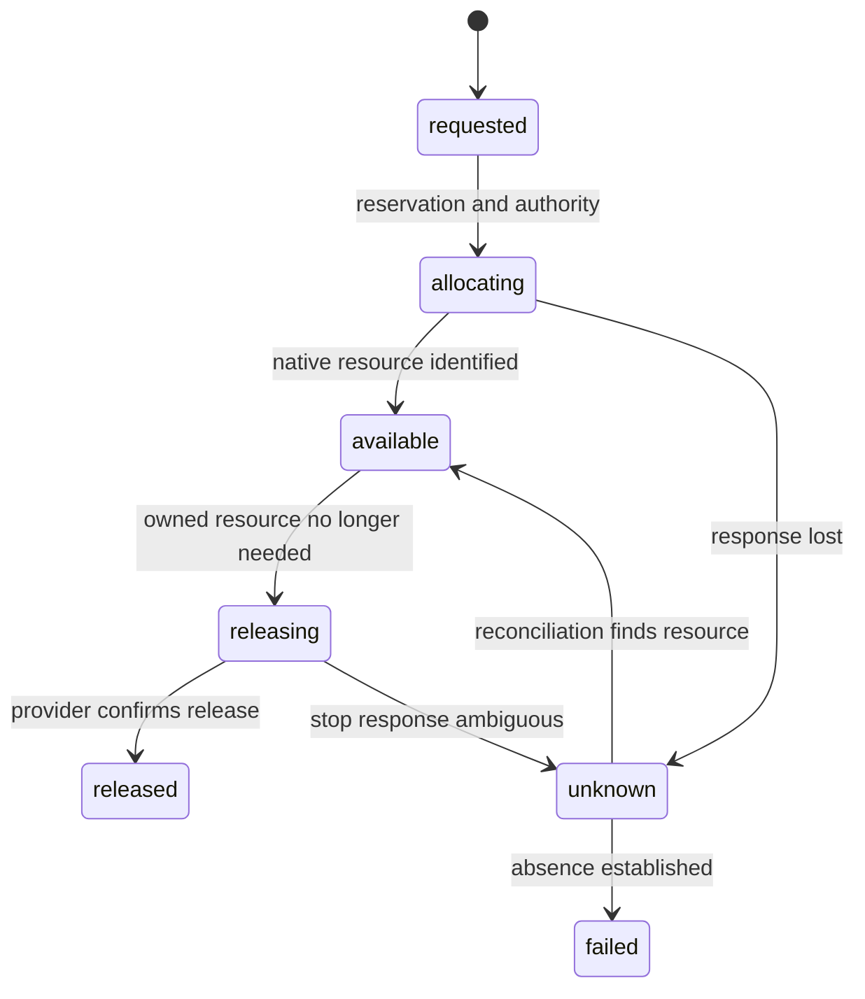

# Compute backends: attach, interactive, delegated and curated execution

Planning edition **0.7.0** · 29 September 2026. Architecture and delivery proposals are unimplemented; upstream facts retain their own verification dates. No compute is provisioned or purchased by this plan.

This is the authoritative provider-order, capability and resource-lifecycle design. All profiles are proposed and untested. Primary evidence S35–S42 records vendor-described capabilities; account terms, rates, region, privacy and runtime compatibility remain qualification work.

## Decision and product boundary

Make customer-supplied compute available across Community/local, Hosted free, Team and Enterprise. Preserve the independent local application. Define the generic runner/admission boundary in M1 and then qualify small adapters for specific providers; provider choice is not a subscription tier. A customer may train in one approved environment and install the release in a different qualified environment. Runtime compatibility and suitability for the recipient's task remain separate gates.

Recommended sequence: conversational local assistant + restricted CPU workload core → Colab interactive notebook and local/Runpod portability → collaborative coordination → generative applications → actual GPU SFT and agent simulation. ZeroGPU is an optional curated demonstration after the generative application exists. HF Jobs is the next batch adapter or a substitute if a pilot already uses it. AWS, Azure, CoreWeave, Snowflake and Databricks require a named customer need. A provider account or a GPU alone does not establish a supported profile.

The durable coordination host remains separately OPEN: choose an existing qualified customer host first for a private pilot, or a small platform-operated durable host when shared service demand justifies it. It must satisfy database, backup, identity and operational requirements. Colab and ZeroGPU are not proposed homes for the authoritative database or durable queue. No AWS account is a prerequisite for the local core or these adapter designs.

Assistant inference and workload compute are separately bound. [local_model_runtime.md](local_model_runtime.md) defines the proposed local llama.cpp/Qwen assistant and D16/D17; that does not select a training provider or change D01/D04. The persistent UI/coordinator stays on a durable user/customer/platform host. Colab is not its daemon host; ZeroGPU is not an always-on development agent. A user can retain local chat while attaching remote compute, with explicit data-transfer and charge disclosure.

M1 generated-code execution requires a restricted dedicated VM. The local binding proposes this boundary but has no evidence yet. Colab and initial provider profiles accept reviewed bounded recipe artifacts under their declared trust model; their attachment alone does not authorise arbitrary live code generated by an agent. A generated-code capability must be explicitly qualified for each binding. A binding lacking it can still execute a reviewed packaged recipe, while live custom-code dispatch is refused.

## Connection modes and responsibilities

| Path | Customer action and authority | Platform responsibility | Resource destruction and payment |
|---|---|---|---|
| Attach existing host | Start a reviewed runner image/process on a supported host; configure narrow local secret references and outbound identity | Validate workload/binding; lease scoped jobs; collect receipts and artifacts; stop only owned job processes | Customer retains host lifecycle and pays provider; platform must not delete host or unrelated storage |
| Delegate provisioning | Connect a permitted account/project with reviewed resource, region and cost scope | Reserve envelope; request resources; record provider IDs; launch jobs; stop/release owned resources; reconcile | Customer pays provider directly; platform may release only resources created under its recorded lease; customer retains revocation/account authority |

Colab is a special interactive path: the user launches the notebook and the SDK executes the bounded workload locally in that session. It is not a persistent queue worker. ZeroGPU is a special function-serving path: a curated operation adapter handles one bounded invocation. It is not an attach/provision interface for arbitrary jobs. A conventional attached runner may connect to a local coordinator or hosted coordinator; hosted sign-up is not required for basic use. Disconnected installations retain their existing local authority and receipt rules.

## Provisioner, executor and serving contracts

| Contract | Illustrative operations | State owned / required semantics |
|---|---|---|
| Provisioner | `inspect_account`, `estimate`, `ensure_resources`, `inspect_resources`, `release_resources`, `reconcile_resources` | Allocation request ID, native IDs, ownership tags, rate evidence, region, expiry; ambiguous creation must reconcile before retry; attached mode has no provisioner |
| Executor | `describe_capabilities`, `preflight`, `submit`, `status`, `checkpoint`, `pause`, `resume`, `cancel`, `collect`, `reconcile` | Job/attempt/fence, supported family/operation, deadlines, observation provenance, durable checkpoints and artifact commits; unsupported operations are explicit |
| Serving adapter | `validate_binding`, `deploy_release`, `health`, `observe`, `rollback`, `retire` | DeploymentBinding revision, independently qualified release profile, endpoint identity, data/tool bindings and operating owner; supports only declared HTTP/MCP/client profiles |

These are planning interfaces, not implemented SDK methods. A vendor can combine allocation and submission in one API; our records still separate their authority and cost consequences. An executor invokes a workload-family adapter; it does not replace the family contract with a universal training function. Provider CLI strings are not a public job interface. Trusted adapters construct allowlisted invocation parameters from typed fields; model-generated shell text cannot bypass them.

## Binding selection and admission

`ComputeBinding` is a mutable aggregate whose revisions are immutable. It records tenant/project ownership, provider/account reference, connection mode, contract revisions, declared capabilities, resource requirements, operation/purpose limits, permitted region/data classes, credential/store references, operator/payer, isolation expectations, cleanup policy and qualification report. A draft binding can describe a proposed profile; only a qualified, authorised binding may execute. Live resource discovery is recorded separately and compared before each attempt. Schema validation is necessary but cannot attest the host or approve authority.

An `ExecutionRequest` selects WorkloadSpec revision + ComputeBinding revision + operation + logical idempotency key. Admission derives tenant, grants and permissions from trusted context. It checks exact input/split identities, family, allowed operation, observed CPU/ISA/GPU/VRAM/driver and dependency lock, time limits, network/storage permissions, region/purpose, qualification evidence, quota and full spending exposure. Training workers cannot read the evaluator's final partition. When no binding qualifies, report reasons and preserve the draft; do not silently choose another provider or a different model.

The retained support reference workload requests no GPU and **£0 external spend**. It is preserved as a useful local example. Its planned Runpod request is explicitly blocked until a reviewed new workload revision and genuine trusted grant permit paid execution. A missing grant, unknown quote or draft profile never becomes an approved budget merely because an example contains an account reference. The four binding examples likewise contain no actual account connection, resource, test report or entitlement.

The draft 0.3.0 schemas make the distinction explicit: WorkloadSpec.execution_requirements is provider-neutral; ComputeBinding.profile_scope and billing_mode describe the candidate environment; ExecutionRequest freezes the chosen revisions; ServiceSpec.runtime_requirements describes independent serving; ReleaseManifest.execution_provenance records how the candidate was produced without requiring that provider for future inference. Tenant and grant authority are always resolved outside user-provided fields.

Early discovery records the environment that actually runs each component. The desktop/GUI host, assistant host, Colab kernel, Runpod guest and installed serving runtime must not be substituted for each other. Provider catalogue sizes are declared metadata until an authenticated runner reports its allocation. HardwareSnapshot observations are not ComputeBinding capability approval or guaranteed capacity. WorkflowPlan selects a proposed placement; the existing admission path refreshes evidence and reserves before work. Details and UI treatment are in [hardware_discovery_and_planning.md](hardware_discovery_and_planning.md) and [gui_workflow.md](gui_workflow.md).

Customer-operated collectors use scoped connections and local credentials; platform-operated collectors exist only for expressly managed resources. No arbitrary URL scanning, undisclosed inventory upload or billing authority arises from detection. Missing or stale provider observations keep the affected option provisional. Colab and ZeroGPU retain their qualified notebook/function semantics and do not become persistent assistant hosts.

## Capability profiles and qualification

| Profile | Proposed scope and limitations | Evidence before support | Owner / payer |
|---|---|---|---|
| `local-attached-v1` | One user, local CPU, training/evaluation/development serving under qualified environment; no hostile-host seal | D01/D04 preflight, full release and independent install | Customer / customer resources |
| `colab-interactive-v1` | User-operated notebook for permitted train/tune work; checkpoint/export; actual runtime may differ from the local Python lock | Resolve notebook-specific lock; inspect resources; termination/resume/export and independent install; synthetic first | Customer launches and manages account / customer optional plan/storage/API costs |
| `runpod-attached-v1` | Customer-started image and outbound runner; per-customer trusted-code scope | Image, device/driver, storage/egress, scoped identity, A17–A22 and operator trust review | Customer resource operator; platform owns adapter maintenance / customer |
| `runpod-provisioned-v1` | Delegated lifecycle for one initial resource/attempt; no implicit spot migration or cross-provider fallback | Above plus create ambiguity, ownership-checked release, retained-disk and cost reconciliation | PL for delegated lifecycle; customer for account authority / customer |
| `hf-zerogpu-demo-v1` | One curated generative operation; synthetic/open demonstration data only; D14; no generic training or arbitrary plugins | Separate Gradio/spaces/Python/torch compatibility, queue/quota identity, no paid fallback, interface semantics, output/log limits; A23 | Publisher operates Space; invoking user consumes correctly attributed quota / publisher plan and user costs explicitly disclosed |
| `hf-jobs-batch-v1` | Future batch training/evaluation adapter; no serving implication | Actual account terms, API, hardware, storage, cancellation and cleanup; same G3 tests | Delegated PL or customer-operated CLI / customer |
| Partner profiles | AWS/Azure/CoreWeave or warehouse-specific jobs and serving, qualified separately | Account/region/runtime/identity-specific evidence and maintenance owner | Customer first; managed contract names any platform obligations / respective account holder |

Only the first five are scoped for the revised near-term milestones; none is supported yet. HF Jobs is a ranked next integration, not an extra mandatory dependency. Runpod is selected to test the single-resource lifecycle before a larger estate integration, not because a price or performance advantage has been demonstrated. A CoreWeave customer's Kubernetes/Slurm environment can be integrated without operating our own cluster.

Qualification status is `planned`, `tested` or `unsupported`; operational binding state is `proposed`, `qualified`, `suspended` or `retired`. A future qualified binding requires a tested report and reviewer identity, plus per-run trusted admission. An unsupported feature must fail early: e.g. submitting classical training to the ZeroGPU demo binding, using a CPU profile for LoRA, or requesting restricted customer data in an unapproved region.

## Failure, cleanup and billing are separate

This diagram describes provider resources, not job success. An attached host remains outside this lifecycle. Unknown resource state requires inventory/request reconciliation and bounded operator escalation; do not create a replacement while an overlapping charge or side effect is unresolved. Native idempotency is used where available; where absent, correlation tags and a serialized resource ledger reduce risk but do not establish exactly-once provisioning.

Before work, reserve estimated compute plus startup, minimum billable exposure, transfer, checkpoint storage, evaluation/provider calls, retries and a FIN-approved uncertainty allowance. D13 limits initial concurrency. D15 proposes 60-second reconciliation and 300-second idle stop requests; these are application policy targets and do not assert provider enforcement. Batch resources are released after durable result/checkpoint collection; failed export triggers bounded recovery, not unlimited paid waiting. If a billed resource is intentionally retained, name its owner, purpose, expiry and new reservation.

Cancellation persists a request, stops new work/spend authority and attempts provider termination. It does not prove immediate GPU release, absence of tool effects or a final invoice. Keep unsettled reservations until sufficiently reconciled; record separate `cleanup_pending/confirmed/unknown` and `estimated/observed/invoiced/reconciled` financial states. Release of compute may leave disks, object data or reservations. Delete only permitted temporary objects; retain approved checkpoints/evidence according to policy and charge them explicitly. Customer-created infrastructure is never automatically deleted.

Shared API credentials, delayed prices, minimum charges or uncontrollable provider billing can defeat a claimed hard monetary cap. Prefer narrowly scoped accounts, provider-native bounds where established, conservative reservations and no automatic paid overage. If bounded exposure cannot be supported, reject that paid automation profile or offer a clearly customer-operated mode; do not advertise guaranteed spend enforcement. Meter useful work, failed work and provider/platform fault attribution separately from customer invoices.

Pause stops new dispatch immediately after durable acceptance; a provider-specific stop/checkpoint may remain pending. Retain resource/charge reconciliation and apply D15 idle policy while paused. Resume requires compatible checkpoint, current requirements, rights and remaining grant. No automatic cross-provider resume or paid fallback occurs. The UI remains usable even when a provider is unavailable, but cannot claim the unreachable worker stopped. Full semantics are in [conversational_control.md](conversational_control.md).

## Security and service independence

Customer-supplied compute means the customer selects an infrastructure trust domain; it does not mean a compromised host is safe. An attached runner is job-control software, not an isolation mechanism. Local administrators and infrastructure operators may access data. Review the actual isolation and data terms before processing private inputs; synthetic work can proceed without pretending that it proves confidential production suitability. Arbitrary managed multi-tenant code remains subject to ADR07. Provider containers, GPU partitions and scheduler labels alone do not satisfy it.

Workers use short-lived partition-scoped data/artifact tokens where possible; provisioning authority and evaluator secrets stay elsewhere. Use locally resolved credential references and narrow mounts. Outputs, logs, notebooks and receipts are untrusted and scrubbed before coordination ingestion. Binding revocation stops new jobs; active jobs/resources are reconciled. A provider/region change requires permitted data movement and compatible checkpoint evidence; no cost optimiser may expand its own provider permissions or test access.

For ZeroGPU, quota attribution and paid-credit behaviour must be established for the exact invocation path. If our adapter cannot determine and enforce a no-charge allowance for an account that can consume prepaid credits, it must not promise a zero-cost automated call. Keep that integration unqualified for zero-spend automation, or offer a clearly disclosed user-operated external demonstration. The platform cannot control arbitrary calls made directly through a user's HF account; native account spending remains their responsibility. Neither a front-end counter nor a disabled purchase button proves that an existing credit balance cannot be consumed.

The deployed inference service contains the approved pipeline and policy. Its normal HTTP/MCP traffic does not traverse the hosted control plane or training account. A provider-specific serving wrapper may be optional, but must preserve the application boundary and declare unsupported auth/protocol features. A Space's discoverability, a container's successful start and a provider's generic MCP support do not establish our release's parity, task quality or operational commitments.

## Readiness and economic evidence

Use A17–A23 in delivery_plan.md and existing G1/G2/G3. M1 proves the local core; M1R compares local and Runpod execution for complete evidence, independently installable releases and resource/cost reconciliation. M1C proves Colab export and recovery separately. Together M1 + M1C + M1R form the first portability milestone. M3Z does not pass G4 on synthetic data or permit public exposure without G5. All free/shared execution has an explicit lack of contractual availability promise; managed service SLOs need separately measured provider and operator evidence.

Basic runner/specification/reference-adapter software remains in the proposed Apache-2.0 core; customer pays its compute directly. The platform still bears maintenance and support cost, measured as setup/recovery minutes, adapter breakages, reconciliation delay and cost per accepted release. Retain separate software, coordination, operation and compute prices. Prefer no platform GPU subsidy initially; commercial_and_marketplace.md shows how a subsidy or additional support changes break-even. The new provider work adds 12–18 person-days to the core plan, plus an optional 4–7 days for M3Z. These are estimates requiring PO/FIN approval.

## Task breadth and output independence

The common executor covers preparation/analysis as well as the four ML/AI families. Bindings must explicitly qualify `prepare`/`analyse`, permitted-snapshot access, parser dependencies and D20 bounds; a training/GPU label does not confer those capabilities. M1 is local ETL/EDA plus classification/regression; M1B adds grounded text; Colab and Runpod stages remain M1C/M1R. Gold/analysis exports are independently reproducible without the original provider, just as service inference remains independent. ZeroGPU stays a curated inference demo, not bulk ETL, persistent monitoring or a general code agent. Monitoring checks use the same bounded executor; scheduled checks require separate authority and payer, with no implied free compute.

## Desktop, task and data-scale implications

The customer desktop/harness may be local while a bounded multi-source join, Unsloth training job or audio/vision task runs on an attached/delegated host. ComputeBinding qualification intersects TaskCapabilitySpec and WorkloadSpec; a GPU offer is not general library support. D20 limits ingestion batches, not project dataset count; D22 and actual spill/memory constrain each materialisation. Use approved stores and pinned collection members, transfer only permitted subsets and meter scan/spill/egress as well as model use.

The local harness exports permitted results to a scoped filesystem OutputBinding with resumable transfer and verified commit. Provider completion alone is not local export completion. Local/customer users operate/pay for their host and provider; the platform operates only contracted coordination or managed execution. Colab remains M1C interactive, Runpod M1R, optional ZeroGPU M3Z curated inference; none becomes the desktop control plane or universal task runner. [desktop_experience.md](desktop_experience.md) and [task_expansion.md](task_expansion.md) define the related boundaries.
