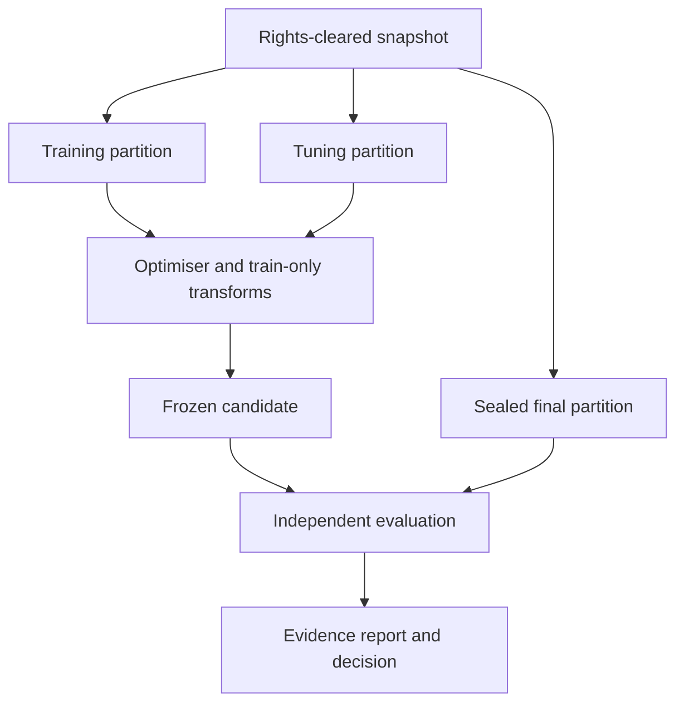

# Data and evaluation across compute environments

Planning edition **0.7.0** · 29 September 2026. Architecture and delivery proposals are unimplemented; upstream facts retain their own verification dates. No compute is provisioned or purchased by this plan.

The same frozen data identities, train-only transformations, evaluation contract and promotion rule apply on local, notebook and provider execution. Change compute only within admitted rights and capabilities. D01–D18 and EO/DO/ML ownership are defined in requirements_and_decisions.md; all performance thresholds here are proposals.

## Task-appropriate evidence

Data preparation and EDA are first-class M1 tasks; they do not need a fabricated target, held-out predictive score or optimiser. Freeze their question, population, grain, joins, denominator, permitted method, checks and material claims. An independent code/query rerun plus DO/DE review checks descriptive results. EDA conclusions remain exploratory; data used to formulate a hypothesis cannot also establish an unqualified confirmatory claim. Causal or predictive claims require an appropriate separate design/evaluation cohort. A sample profile is labelled as sampled and cannot establish full-source completeness.

Gold preparation uses [data_products_and_tasks.md](data_products_and_tasks.md): preserve raw assets, normalised records and task-ready tables/corpora. Fix types/units/key roles explicitly, record all rejected rows/pages and uncertain OCR, validate join cardinality and reconcile source/output counts. Never fit imputation/scaling/feature selection across the whole corpus as a “gold” preprocessing shortcut. Deterministic, nonlearned source normalisation may precede splitting under frozen rules; learned preprocessing fits training partitions only. Final-set previews/EDA remain denied to optimisation.

For data/analysis acceptance, hard schema/key/lineage/access checks must all pass, material aggregates must match independently recomputed values under declared rounding/tolerance, and an accountable reviewer must accept semantic meanings/limitations. Missing source coverage, unresolved extraction or unreviewed material assumptions yield INSUFFICIENT_EVIDENCE. A known violated check yields FAIL. Do not hide excluded data to pass quality gates. For predictive/generative tasks, use their separate frozen EvaluationContract and sealed or independently labelled evidence.

## User intent, generated code and assistant evidence

Plain-language constraints become versioned data/pipeline policies before execution. Exclude row/entity identifiers from predictors unless explicitly justified and authorised; preserve ID formatting and audit nulls/duplicates. Use entity/time grouping according to intended generalisation. “Minimal features” must define source-field versus transformed-feature counting and hard cap versus soft optimisation under quality constraints. Do not count a TF-IDF vocabulary as one transformed feature merely because it comes from one text column.

Output rounding is a deterministic transformation, not an anonymity claim. Evaluate both the released rounded result (the acceptance target) and restricted raw diagnostics where permitted; specify units and tie handling. A new feature rule requires refit and reevaluation; a new postprocessor requires output regression/evaluation and a new release. Keep old evidence attached to its original revision. Repeated final-set exposure triggers EO review and possibly a new independent cohort, even if a change arrived through chat.

Generated Python/SQL is an untrusted transformation artifact with source digest, inputs, lock, requirement revision and measured execution record. Notebook text/plots and the HTML report must derive from committed outputs. The assistant never has credentials for sealed cases or evaluator internals. Summarised context excludes raw records by default and cannot erase canonical constraints; chat history is not the authoritative specification.

Evaluate the platform assistant separately from the customer's workload: the proposed local-model suite in [local_model_runtime.md](local_model_runtime.md) covers interpretation, tool schemas, actual code success, control races and injection, with held-out tasks and repeated stochastic runs. Do not report assistant task-completion rates as classifier quality. G1/G3 require both kinds of evidence for M1. Conversation/code artifacts follow purpose, access, retention and deletion controls; production messages are not automatically approved training examples.

## Governed data lifecycle and movement

Data movement is an admitted operation. Record which ComputeBinding, role, region and store may receive each snapshot/partition before transfer. A cheaper or available GPU does not authorise a new processing location. Provider staging, notebook output, object caches, checkpoints and logs are governed derivatives with deletion/retention owners.

Capture a snapshot identity from source locator/version, query or export recipe, extraction timestamp, watermark, schema, content digests and rights. Record label availability time separately from event time. A snapshot's permitted purposes explicitly distinguish preparation, training, tuning, evaluation, inference, human review and redistribution. “Available on the internet” is not a licence.

Semantic contracts include field meaning, missingness, allowed values, units/currency, text encoding, timezone and event-time/ingestion-time conventions. Validate at ingestion and serving. Quarantine bad rows with reason/count and owner decision; do not silently discard a difficult population to improve scores. Keep raw immutable snapshot separate from versioned transformations and from notebooks.

A transform records input/output hashes, reviewed code revision, fit scope, parameters and removal/redaction counts. Any imputer, scaler, vectoriser, target encoder, vocabulary selection or learned feature extraction is fitted only on the fold's allowed training data. scikit-learn documents pipeline-based leakage prevention [S04]; the proposed platform must still verify actual partition access. Store the fitted preprocessing in the release, not a second serving reimplementation.

## Splits, principals and sealed access

For support intake, group all turns, attachments and paraphrases belonging to an underlying case/customer/template family before splitting. In real deployment, use a later-time final cohort and customer/entity grouping where feasible; explicitly state whether evaluation estimates new cases for known customers or generalisation to unseen customers. These are different estimands. Time splits use label-availability cutoffs and training joins as-of event time; future status/agent replies cannot become features.

The synthetic demonstrator proposes 6,000 cases from 1,500 independent scenario families with four variants each, class balanced across billing/access/product/other. Stratified group split: 3,600 train, 1,200 tune, 1,200 sealed final. ML uses 5-fold grouped CV within train for the 12 allowed configurations. Tune is further group-split into 600 calibration examples and 600 threshold/selection examples. No final-set use for calibration, threshold choice or stopping. If the generator cannot achieve independent, balanced groups, revise sample construction before claiming the target counts.

Inspect exact duplicates, near-duplicate text, shared entities, attachment fingerprints, template ancestry and temporal feature availability. Synthetic train and final cases must not merely be parameter substitutions from the same templates. Hold out template/scenario families; use independently reviewed wording. Synthetic evaluation tests plumbing and limited task behaviour, not real-world product value.

| Principal | Allowed access | Explicit denial |
|---|---|---|
| Preparation service | Source snapshot, train/tune; split membership creation under EO policy | Unreviewed export; final labels after freeze except approved split job |
| Optimiser worker | Training folds, permitted tune inputs/labels, aggregate training metrics | Final partition objects, EO secrets, oracle code modifications |
| Candidate inference sandbox | One final input at a time during authorised evaluation | Labels, test directory listing, outbound network, arbitrary telemetry |
| EO evaluator | Frozen candidate, final inputs/labels and oracle | Writing model weights or search contract |
| Publisher/PO | Redacted report and signed evidence | Unnecessary sensitive case details |
| Domain adjudicator | Assigned cases and label rubric, preferably blinded candidate identity | Silent relabelling of final set to favour a candidate |

Final-set references may be visible as IDs without granting content access. Avoid leaking examples through previews, notebook output, trackers, exceptions or download URLs. Access ledger records who evaluated which digest under which contract and how many disclosures occurred.

Interactive notebooks receive train/tune data only. Notebook owner access cannot establish independent sealing; final evaluation runs under an independent authority/environment. Colab outputs and mounted stores are part of the data inventory. The proposed ZeroGPU profile accepts only approved synthetic/open demo content, never sealed tests or private customer artifacts by default. Quota exhaustion returns an explicit outcome and cannot trigger transfer to a different provider or unapproved paid run. A new region/provider binding triggers DO/SEC review of movement and retention. See compute_backends.md and A17–A23.

An evaluator uses a separate qualified binding and principal with a purpose-specific sealed-data grant. The optimiser never inherits that grant through a shared provider account. A candidate still sees individual inputs inside restricted inference, not evaluator storage or labels. The same machine/account owner cannot attest strong independence from themselves.

## Evaluation contract

Freeze: intended use/population, baseline, candidate class, metric definitions/denominators, split IDs, slices, oracles, stochastic repetition, uncertainty method, multiple-comparison treatment, thresholds, operational load, costs, required sample sizes, final-access allowance, owners and decision rules. Bind evaluation code and human rubric revisions. A schema-valid contract with missing owner agreement cannot authorise acceptance.

### Routing example: proposed acceptance contract

| Measure | Meaning and denominator | Proposed rule / rationale |
|---|---|---|
| Macro-F1 | Unweighted mean of per-class F1 over all eligible final cases, including cases later abstained; report class confusion separately | Point estimate ≥0.80 and grouped-bootstrap 95% lower bound ≥0.75. Demonstrator floor, not customer-approved quality. |
| Automatic-routing precision | Correct predictions among non-abstained cases at threshold fixed on tune | One-sided 95% lower bound ≥0.90 using a scenario-group bootstrap; Wilson only for a genuinely independent case cohort. Justify with misrouting costs at G0. |
| Coverage | Non-abstained / all eligible cases | ≥0.50; prevents solving precision by always deferring. |
| Per-class/slice recall | Correct class assignments / true cases of that class within declared slice | Report every slice. Proposal: point recall ≥0.70 for material slices with ≥100 cases; otherwise INSUFFICIENT_EVIDENCE for that slice. |
| Calibration | Multiclass Brier score; reliability plot with predeclared bins and counts | Diagnostic; no invented confidence. Predictive probability shown only with calibration evidence. |
| Workflow cost | Sum of agreed cost matrix for routing errors, review, abstention and delay divided by eligible cases | Require paired expected-cost improvement vs deterministic baseline with 95% interval excluding zero on representative customer data. |
| Operations | Warm p95 latency at D04 profile; memory high-water, errors and measured cost/1,000 calls | p95 ≤300 ms and no OOM at proposed load; measure cold start separately. |

For the synthetic support reference release, business workflow cost is labelled illustrative and cannot establish G4. Passing synthetic task thresholds permits a demonstration listing only. A real customer's cost matrix supersedes these proposals through a new contract, not retroactive edits to a report.

The EO predeclares primary acceptance endpoints and conjunction: all hard controls and all required quality/operating criteria must pass. Clear violation yields FAIL. Insufficient sample, wide intervals spanning an acceptance boundary, missing labels, nonrepresentative data or inability to verify a condition yields INSUFFICIENT_EVIDENCE. Do not count an unavailable label as correct or silently exclude it. Report exclusions with reasons and coverage.

## Task-specific metrics

| Family/task | Core measures | Additional controls |
|---|---|---|
| Preparation / EDA | Source coverage and quarantine counts; key/null/type/units/join checks; reproduced aggregate/plot values; claim-to-query lineage | No causal inference from correlation; sample/censoring limits explicit; zero optimiser trials |
| Classification | Per-class precision/recall/F1, confusion, calibration, expected cost, abstention coverage | Imbalance, group/time leakage, human workload |
| Tabular regression — M1; forecasting later | MAE/RMSE in business units, quantile loss/coverage, forecast horizon/slice error | Rolling-origin baseline; label delay; asymmetric errors; no random split for temporal claims |
| Clustering — later | Stability under resampling, separation diagnostics, expert usefulness | Unsupervised scores do not demonstrate customer utility; no fabricated accuracy without ground truth |
| Grounded extraction | Field-level exact/normalised match; unsupported-field rate; citation support/coverage | Missing fields vs hallucinated fields distinguished; evidence spans validated |
| Response drafting | Blinded expert rubric, material factual-error rate, escalation appropriateness, time to usable draft | Never send automatically in reference workload; LLM judge is supporting evidence |
| Retrieval | Recall@k over labelled relevant passages, relevance/faithfulness, access-filter compliance | Pin corpus/embedding/chunk/index revisions; no cross-tenant matches |
| Weight adaptation | Same task contract for base vs adapted model; loss only as training diagnostic | Trainable parameter count/hash changes; general capability/regression and privacy checks |
| Agent episodes | Independent terminal-state success, permissions, loops, duplicate effects, recovery, escalation quality | Reward is reported separately from success; constrained actions and episode budgets |

Do not combine these into a universal score. Show task-specific feasible sets and a shared business outcome (human time and error burden) only when all variants are measured on the same workflow protocol.

## Statistical treatment and provider comparison

For 1,200 independent binary outcomes with observed proportion near 0.90, the simple binomial 95% half-width is roughly 1.7 percentage points; clustering reduces effective sample size. This is a planning calculation, not a confidence interval for an unrun model. Bootstrap by original case/scenario family, not individual correlated variants. Predeclare 2,000 bootstrap resamples as a computational default and inspect Monte Carlo stability. Small slices remain inconclusive, even with perfect observed scores.

A 95% upper bound for zero observed incidents is roughly 3/n independent opportunities: zero in 1,200 cannot justify a one-in-a-million safety claim. Count opportunities explicitly, including failed/aborted agent episodes. Predefine severity and report every observed violation; zero tolerated violations is a release gate, not proof of zero population risk.

Optimisation sees grouped CV and designated tuning scores. Record every attempted configuration, failed/pruned run and stopping reason. Use tuning data to select a single finalist or a predeclared small set. Run final evaluation once per authorisation, including the deterministic baseline for paired comparison. If selecting among several candidates on final results, adjust inference (for example Holm correction on declared tests) and report that selection; preferably reserve a new independent confirmation set. Adaptive tuning confidence intervals are descriptive until independent confirmation.

After final-case disclosure, that set cannot repeatedly support unqualified acceptance of revised candidates. EO may keep a restricted long-lived regression suite, but substantial optimisation informed by its failures requires a refreshed independent cohort. Data scarcity is an explicit limitation; it does not justify pretending a reused test set is sealed.

Generative/agent variants propose five stochastic repetitions per scenario for the M3/M4 development suite, clustered by scenario, with seed/config/provider revision captured. Size the final repetition scheme from pilot variance and cost. Five repetitions is a variance probe, not universal sufficiency. Do not use identical seeds across providers as evidence of identical randomness.

A provider change preserves task, source/split identities, train-only transforms, frozen oracle and final-set access policy. Hardware/provider/runtime observations are recorded per attempt. Compare local and remote training on permitted development partitions first; EO defines acceptable numerical/statistical differences before inspecting comparison results. The M1R portability test need not consume another final-test access: installation and protocol parity use approved replay fixtures. Fresh retrained candidates enter sealed evaluation only under its existing access budget or an EO-approved new evaluation cohort.

## Oracles, judges and agents

Prefer exact state/schema checks and independent expert labels. For extraction, compare fields to permitted evidence spans and annotations. An LLM judge's model revision, prompt/rubric, temperature, retry policy and cost are part of the evaluation environment. Before using it, compare against at least 200 proposed human-labelled cases spanning hard negatives and material slices; report disagreement and adjudication, with uncertainty. The EO decides whether this is enough. Separate generator/judge models when possible but still test shared blind spots; different brands are not proof of independence.

Agent evaluation uses a resettable simulator snapshot and a separate final-state oracle. Count success only if the required proposal is correct and permitted, not because the agent emitted “done”. Include tool unavailability/timeouts, repeated acknowledgements, poisoned documents, permission-denied paths, endless loops, conflicting evidence and safe escalation. Evaluate action ledger and final environment state for duplicated effects. Assess simulator gap before any real tool access. Real mutations are outside the reference demonstrator.

## Resource evidence and development self-checks

HardwareSnapshot and WorkflowPlan preserve the environment assumptions used to recommend and admit a candidate. Compare candidates on the frozen task/protocol, and qualify measured time/cost by actual hardware, load, model settings and date; an inventory has no task-quality score. Smaller hardware cannot justify reducing the sealed population or loosening thresholds. Changes to precision, batch semantics, assistant/model settings or data placement trigger the relevant regression and rights review. See [hardware_discovery_and_planning.md](hardware_discovery_and_planning.md).

In [gui_workflow.md](gui_workflow.md), development self-checks inspect schema, code and train/tune results. The subsequent independent evaluation uses the EO-controlled oracle and access boundary. A completed self-check is never displayed as a final quality PASS. Workflow recommendations and assistant-generated report explanations are evaluated separately from fitted-model performance.

## Notebooks and HTML evidence

The same versioned evidence powers the GUI's interactive report and offline export. Sorting/filtering uses already authorised aggregates; it cannot expose final cases or create unrestricted new final-set queries. Artifact drill-down checks each object's permission, even when linked from chat. A user correction creates a new typed proposal and marks affected evidence stale, preserving the original report and its limitations.

Generate notebooks from recorded run artifacts and reviewed templates. Required sections, as applicable to the task: question/assumptions, rights/data lineage, schema/quality profile, split rationale, deterministic baseline, fit/tune configuration, learning curves where meaningful, confusion/calibration or task-specific plots, uncertainty/slices, compute binding/profile, observed hardware and startup/queue/execution/cleanup timings, resource/cost use and limitations. Executed cells call the same versioned pipeline/library code used by the job; the notebook is an explanatory view, not the only executable source. A fresh-kernel replay check records environment and permitted data availability. Export notebooks without raw sensitive rows by default.

The self-contained HTML report (analysis findings or service candidate selection) must work offline with bundled assets and a readable text alternative. It contains: decision and PASS/FAIL/INSUFFICIENT_EVIDENCE; scope; frozen contract; baseline/candidate table; feasible-set quality/cost/latency plot with conditions; rejection reasons; split/access evidence; uncertainties and slices; human review; resource usage including failures; reproducibility level; rights/dependencies; service compatibility; approval status and next action. Numeric tables are rendered from signed EvaluationReport JSON, not narrated from an LLM's memory. Escape all untrusted text; forbid remote script/assets and injected HTML. Missing values say “not measured”. No selected candidate is presented when the feasible set is empty. An EDA report instead presents checked findings, data-quality limitations and unanswered questions; it does not invent candidate metrics.

The selection report distinguishes training execution evidence from serving qualification. Include native provider rates/measurement date, payer, retries, retained storage and unsettled costs; mark unknown costs rather than calling a subsidised or prepaid run free. A Colab notebook remains an explanatory/replay artifact, while the exported application core is the serving implementation. A ZeroGPU demonstration contributes only the evidence actually collected for its declared operation/profile.

## Reproducibility, feedback, monitoring and deletion

* **Exact replay:** same preserved inputs and recorded outputs or deterministic execution in a qualified identical environment; specify which. Replaying a trace does not prove current provider behaviour.
* **Controlled rerun:** same code/locks/data/config and declared hardware/provider revision, with measured tolerances. Hosted providers may not expose an immutable revision.
* **Statistical reproducibility:** repeated outcomes satisfy a predeclared distribution/interval criterion. Bitwise cross-hardware/provider equality is not promised.

Record model, tokenizer, prompt, policy, retrieval corpus, chunking, embeddings and index recipe versions. Indexes/caches/reports rebuild from authoritative inputs; indexes that cannot be faithfully reconstructed require a preserved qualified snapshot and rights. Cache keys include tenant, identity/ACL version, release, binding/corpus version and relevant inputs; invalidate on permission/deletion changes.

Monitor schema changes, feature/output distributions, abstention, errors/latency/cost and reviewer overrides immediately. Delayed ground truth is joined by immutable decision ID with censoring/coverage/window reported. Drift is a diagnostic, not proof of performance degradation or permission to retrain. Observed outcomes may be influenced by previous model actions; preserve intervention assignment and compare suitable controls.

Separate monitoring logs, evaluation candidates, expert labels and training-authorised examples. Promotion of a record into training requires rights, purpose and label-quality approval. Feedback from vocal users or only accepted recommendations is biased; sample abstentions and unassisted cases too.

Deletion creates a scoped tombstone and lineage traversal across snapshots, transforms, indexes, caches, traces, reports and backups. Record completion/exception evidence; replay tombstones on restore. Personal content may require redacted replacement reports or withdrawal while minimal nonpersonal audit records remain under justified retention. Immutable identity does not mean indefinite byte retention. Deleting source rows does not erase trained influence: DO/CL/ML assess memorisation/exposure, continued lawful use, retraining, validated unlearning or withdrawal. Do not promise machine unlearning as an implemented capability.

Keep checkpoint, optimiser/scheduler/random state where applicable, code/environment identity and dataset cursor in an exportable checkpoint manifest. A resumed GPU job is a controlled rerun unless exact replay is specifically established. Changed CUDA, precision, kernels, model revisions or provider execution policy can invalidate prior performance evidence. Pricing comparisons report startup/model download, queue time, interrupted/repeated work, storage and cleanup, alongside useful execution; an idle GPU hourly price is not cost per accepted release.

## Versioned analysis and monitoring evidence

`AnalysisReleaseManifest` links exact DataProductManifest, WorkloadSpec, RunManifest, report, source code and environment. `MonitoringSpec` distinguishes source freshness/schema/quality, analysis staleness/reproduction, and deployed service performance. Version history/diffs and manual checks are M1; scheduled source access is M2 and requires explicit authority. Each check records target/baseline revisions, population/window, expected observation delay, actual run time and outcome. No active schedule means “manual only”, not “monitoring healthy”. Delayed/missing labels mean quality unknown even if runtime health is green.

The new mixed-format operations fixture in [reference_workload.md](reference_workload.md) defines separate EDA, regression, classification and text tasks. Support-routing scores/splits remain a named reference contract and cannot supply thresholds for those tasks. A future regression gate assesses MAE in hours and paired error against its baseline; the output rounding policy is included in evaluation. Independent customer evidence is still required before generalising synthetic findings.

## Relationship integrity and expanded task oracles

Pin the entire source collection and JoinPlan used in a result. Compare full permitted key sets/cardinality and pre/post-aggregation totals before accepting gold; sampled overlap is discovery evidence only. Null/duplicate/missing keys, identity normalisation, units, many-to-many multiplication and point-in-time availability need independent checks. Combined permissions/purposes are the allowed intersection; cross-tenant linkage remains denied. Sealed data cannot be profiled for join selection or used to suggest features. For time-dependent relationships, effective date and actual availability are distinct.

Each later task defines its own oracle and denominator: unsupervised structure needs stability/domain utility or labelled validation, not a universal accuracy; scientific tests need assumptions and dependent-data uncertainty; forecasts need rolling cutoffs and backtest-selection controls; vision/audio need annotation/alignment checks; generative multimodal outputs need task-specific human/exact checks; RL needs independent final-state success separate from reward. Actual versus proposed task support is tracked per capability/profile. The optimiser cannot choose an easier oracle after reading docs.

Filesystem outputs include the collection/join/code/evaluation revisions and limitations; refreshing sources or editing exported code creates a new analysis/release with affected evidence marked stale. A graph preview or an exported HTML report is not validation by itself. [multi_dataset_planning.md](multi_dataset_planning.md) and [task_expansion.md](task_expansion.md) own the detailed contracts; A39–A43 extend G0/G1/G3.
