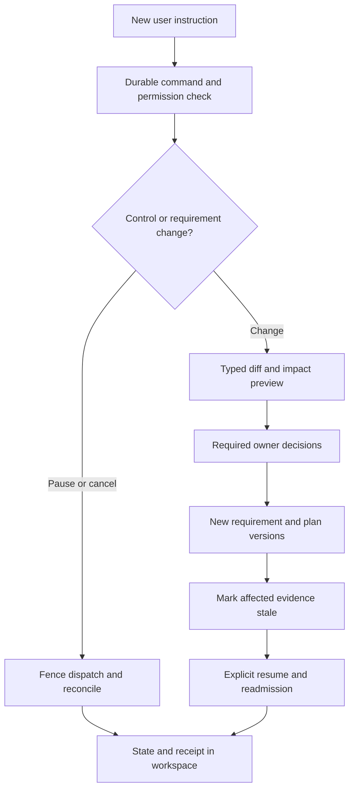

# GUI workflow: conversation, visible work and evidence

Planning edition **0.7.0** · 29 September 2026. Interaction specification only; no application has been implemented or user-tested.

## Design direction and reference

Use the supplied Bridgewater screenshots for visible workflow/evidence, while giving our GUI-native desktop its own open research-workspace design: a flowing stage trail, optional curved relationship canvas, contextual evidence margin and evolving editorial report. Keep a conversation composer available throughout. The screenshots show research stages, data/code activity, self-review and an interactive report. Bridgewater's official PAT page identifies the exploratory-research presentation [S48]; its performance and learning claims are vendor descriptions, not evidence for this product. The video page did not expose a usable transcript in this session; the detailed visual observations come from the two supplied screenshots. Do not infer or copy an undisclosed architecture, branding or investment use case.

Our flow ends in a reproducible data/analysis release or an independently installable service, according to the user's goal, with explicit monitoring ownership. Independent evaluation and release approval therefore remain explicit after development self-checks. Not every task needs both structured and unstructured search. The visible plan adapts to the task while mandatory gates remain invariant.

## Workspace layout

| Area | User experience | Source of truth |
|---|---|---|
| Header | Workload name/revision, current status, selected compute, budget exposure and visible Pause/Cancel | Ledger projection; time-stamped freshness; reserved/observed/unsettled money distinguished |
| Left work trail | Stages and branches with status words/icons; click to revisit intent, plan, artifacts or evidence | WorkflowPlan plus committed job/event/artifact records |
| Main work canvas | Open editorial flow, optional dataset relationship map/list, conversation/activity, plan diff, notebook/code or report | Authorised artifact versions and redacted event stream |
| Contextual evidence margin | Typed requirements, source/provenance, limits, code diff, environment diagnostics and approvals | Canonical contracts; view-only until a typed change is proposed |
| Persistent composer | Plain-language instruction, clarification or correction; direct pause/cancel/status fast path; optional attachments | Durable authenticated ConversationCommand receipt, independent of model generation |

Use progressive disclosure: readable action/result summaries by default; code, logs and detailed configuration on demand. The GUI shows what happened, the concise reason for a choice, its evidence and what needs a decision. Do not label invented model narration as actual execution or expose private internal reasoning under a “Thinking” panel. No token-stream animation is evidence of progress.

At narrow widths the rail becomes an expandable stage list and the details drawer opens inline. Keep the composer and safety controls reachable without navigating away; provide text status as well as colour, keyboard-native controls, focus return after a decision and accessible announcements for important state changes. Scroll position remains stable while activity arrives; allow following live output or reviewing an earlier artifact.

## Stages and evidence

Canonical IDs below are shared with WorkflowPlan. A stage may contain several jobs, but its completion rule is explicit. Status is a projection and not the state machine of an individual job.

| ID / stage | User sees / can influence | Completion or gate |
|---|---|---|
| `goal` — Goal and constraints | Original question and output kind; editable interpretation, ID/feature/output rules; uncertainty and decisions | Material intended-use/data/acceptance fields resolved by their owners; G0 scope |
| `environment` — Environment and context | Local/remote locations, available and unknown resources, qualification gaps, model readiness | Relevant scoped discovery and viable proposed placement; execution still requires fresh G3 admission |
| `data` — Data and sources | Files, parsed assets, gold-table explorer, types/grain/joins, quarantine, source lineage and split plan when needed | Rights and partition controls established; sealed contents remain inaccessible |
| `plan` — Review the workflow | Approach, alternatives, allowed code/tools, bounds, cost assumptions, expected artifacts and gate owners | Current immutable plan/requirements and required authority recorded; no invented approvals |
| `develop` — Develop and optimise | Imported/generated SQL/Python diffs, actual data/analysis outputs, or fitted baseline/trials where needed | Committed analysis artifacts or candidate and lineage; failures visible |
| `self_check` — Development checks | Schema/unit checks, leakage checks, train/tune diagnostics and unresolved issues | Checks completed with their actual outcomes; does not certify task acceptance |
| `evaluate` — Independent evaluation | Frozen method/candidate and appropriate independent analysis checks or predictive metrics, uncertainty and failures | EO-owned PASS / FAIL / INSUFFICIENT_EVIDENCE report; G1 |
| `report_release` — Report and release | Analysis findings or candidate justification, requested output bundle and explicit approvals | G2 packaging and per-profile G3 installation; failing/inconclusive reports are still exportable |
| `operate` — Install and observe | Output versions/diffs, manual or scheduled check state, owner; service installation/HTTP/MCP/health when applicable | Scope-specific G3/G4 reproduction or operation; no auto-refresh or silent promotion |

`pending`, `running`, `waiting_for_user`, `pause_requested`, `paused`, `failed`, `inconclusive`, `completed`, `skipped` and `stale` are proposed display states. Completed means its declared work/evidence is committed; it does not imply an evaluation PASS. An evaluation stage can be completed with outcome FAIL. Show both the completion state and outcome prominently. Skipped requires a reason and is forbidden for a mandatory gate. Stale means changed inputs invalidate prior relevance, not that past work never happened. A disconnected event stream shows “Connection lost; last known state…” and never assumes the work stopped.

## Event projection and intervention

Use the existing message/job ledger and outbox; no separate workflow engine or agent framework is needed. Events carry a tenant-scoped event ID, monotonic conversation sequence, workload revision, optional job/attempt, stage ID, event type, occurrence/recording timestamps, actor category, visibility, safe summary and artifact references. Referenced bodies are fetched with their own access checks. A stage reducer derives display state from authoritative transitions and dependency validity; the LLM cannot emit a trusted `stage_completed` message.

Examples of event types: `command.received`, `discovery.finished`, `plan.proposed`, `requirement.revised`, `job.started`, `checkpoint.committed`, `artifact.committed`, `evaluation.reported`, `approval.recorded`, `job.pause_requested`, `job.paused`, `job.cancelled` and `stream.resynchronised`. Receive-order sequence is authoritative for replay; event occurrence times are informational, not a global ordering guarantee. SSE reconnect resumes from a cursor; unavailable/expired history triggers a versioned snapshot plus later events. Polling remains equivalent. Backpressure may coalesce progress updates, but never discard command receipts, terminal transitions or required evidence links.

“Use account_num as the ID, keep the feature set minimal, and round predictions to the nearest 10” produces a typed interpretation and asks only material questions about feature counting, quality trade-offs, target units and privacy purpose. `account_num` is excluded from predictors; split grouping depends on entity semantics. Rounding is precision reduction, not proof of anonymisation. The tabular M1 regression path handles numeric targets separately from support routing; all current examples remain illustrative and unexecuted.

If the user says “Pause and exclude account_num from features”, persist the explicit pause through the fast path, stop new dispatch, then show the requirement diff and affected fitted/evaluation/release artifacts. Display “Pause requested” until draining is confirmed. No new instruction automatically resumes the run. A completed result remains attached to its original revision. Chat corrections become versioned proposals, never automatic cross-customer training or production changes. See [conversational_control.md](conversational_control.md) for exact authority/race semantics.

## Interactive report and artifact workspace

The report branches by output kind. EDA shows checked findings, data quality, source coverage and unanswered questions without fictional model scores; a service report contains task/constraints, data rights and population, deterministic and fitted baselines, candidate comparison on the same protocol, uncertainty/slices, quality-cost-latency trade-offs, selected candidate rationale or explicit lack of an acceptable candidate, measured operating conditions, limitations and remaining approvals. Each table/chart links to its approved source artifact, metric definition, denominator, workload/candidate revision and evaluation date. Missing measurements are labelled unavailable; no invented chart data fills an empty result.

GUI interaction filters/sorts already authorised report data. Download a self-contained, versioned HTML snapshot plus JSON evidence and notebook; deterministic report generation/validation preserves measured numbers while the assistant may draft a referenced explanation. An “Ask about this result” action attaches only the permitted artifact summary. It cannot expose sealed examples to the optimiser, run arbitrary new slice queries over the final set, or recompute results without a separately authorised evaluation. Expert case review uses evaluator access, not a hidden UI shortcut.

Changing display precision or a chart filter does not mutate the release. Changing output postprocessing, prompt, policy or selected candidate creates the relevant new contract/release and evaluation. Packaging status, service qualification and operational handoff remain visible alongside the report. A report export is useful even if the project is paused or the candidate fails; it must clearly show that release approval is absent.

## First slice, cost and validation

M1 builds a native desktop shell/local harness, a slim work trail, conversation/activity canvas, accessible source relationship map/list, contextual evidence, plan/code diffs and linked notebook/HTML report with a filesystem output shelf. Avoid a drag-and-drop pipeline designer, general IDE, mandatory dual-search stages or multi-agent framework. Later rich chart exploration and fleet comparison require demonstrated user need and authorised data.

B28/B29 and A31–A34 cover the additional scope; existing B24–B27 continue to own local models, conversation, safe code and assistant evaluation. The earlier 6–10-day workflow-view increment remains inside the prior estimate; edition 0.7 adds a separate 8–14-day native lifecycle/filesystem increment within M1, plus multi-source and task-extension work in [delivery_plan.md](delivery_plan.md). UX/PL must re-estimate after the first desktop OS is chosen. This is not a delivery commitment. PO tests whether pilot users can identify the current stage, why a plan was chosen, what remains uncertain, how to stop work and which evidence a change invalidates. Observe task completion and intervention mistakes rather than claim that a familiar layout proves usability.

The local workspace remains usable without a hosted account. Inference clients use the exported HTTP/MCP service directly and do not need this GUI, the development assistant or our hosted control plane. Public listing claims may include only measured compatibility and approved evidence; this reference-inspired design does not establish product feasibility or customer demand.

## Data workspace and post-output controls

The starting screen asks “What would you like to understand or build?” and accepts files or approved references. Suggested tasks include prepare/explore, classify, predict a number, extract/summarise and grounded questions. Free text can combine them; the typed plan resolves stages and advertised capabilities. The visible defaults never require a support ticket or document-intake template.

In the data stage, show source files and sizes, format/OCR status, a typed schema/data dictionary, table grain/key/relationship view, sampled previews labelled as such, extraction coordinates, transformation/code diffs, checks and quarantined records. A proposed gold table is not labelled accepted until required checks and semantic review are recorded. Sensitive/sealed previews remain denied even when linked from a chart.

After completion, the same workspace exposes **Outputs → Versions → Changes → Monitoring**. Show data/code/model/report versions separately; allow comparison and authorised export/rerun. Monitoring displays owner, manual/scheduled/paused mode, last actual check, baseline, freshness, failures and next authorised check (none in manual mode). A new instruction changes a draft/workload or proposes a new output release, never edits an archived report in place. “Turn this analysis into an API” opens the service contract/evaluation/installation branch with its additional requirements.

The nine canonical stage IDs are retained. For analysis, `evaluate` means independent checks of material findings; `report_release` produces the analysis pack; `operate` means version/history/manual checks and optional future schedules. Service-specific substeps may be explicitly inapplicable; required rights, provenance and evidence checks cannot be skipped. No training/probability/service metric is fabricated to populate an analysis view.

## Native design and open-ended source interaction

[desktop_experience.md](desktop_experience.md) is the authority for native launch/close/quit, local harness, visual direction, CLI fallback and scoped filesystem export. The GUI does not require the user to run a terminal server. All nine stage IDs above are retained; a compact visual grouping may expose sub-stages, but cannot hide evaluation/release gates. Warm whitespace, typography, thin rules and context-linked evidence replace a dashboard grid. Tables/code remain rectangular when that supports readability. The preview concept is visual exploration, not an implemented or accessibility-tested interface; illustrative numbers/relations are not contract evidence.

Source browsing is paged/searchable. The relationship canvas displays a selected neighbourhood plus an accessible relationship table, source coverage, grain, keys and proposed/validated/rejected status. Select an edge to inspect cardinality/null/temporal evidence and code; select an unconnected source to see why it is independent or not yet profiled. New sources can arrive through conversation, producing a new collection/plan revision. Do not cram every dataset into the LLM context or into one graph at once.

The output shelf offers Gold data, Notebook, Report, Code, Evidence, Versions and **Open output folder**. Distinguish produced, independently checked, exported, incomplete and stale. Folder selection is a trusted GUI action; the assistant proposes filenames but cannot broaden its write scope. Re-export creates a new version. Endpoint controls appear only for a requested service with applicable gates. CLI output may be concise, but authorised detailed evidence and all controls remain available.

Native updates, model loads, parser builds and docs fetches show their actual state and resource/policy implications. Activity summaries explain actions/evidence, never private internal reasoning. A “clear view” action clears the projection/filter only; it cannot delete required audit history. Pause/Cancel remain accessible while a source graph or report is busy rendering. A44/A45 add native lifecycle, keyboard/list-mode, export and recovery tests.
