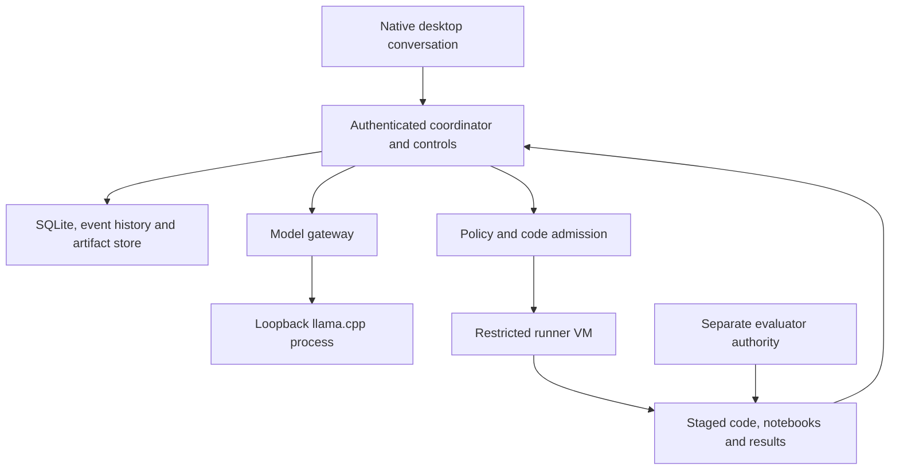

# Local assistant model and code execution

Planning edition **0.7.0** · 29 September 2026. Architecture and delivery proposals are unimplemented; upstream facts retain their own verification dates. No compute is provisioned or purchased by this plan.

The recommended M1 development experience runs the conversational assistant on the user's machine. **Use a supervised `llama.cpp` model server and qualify Qwen3-8B-GGUF Q4_K_M first.** This is a proposed candidate, not a claim that an 8B model can reliably complete the pipeline. It must pass the instruction, tool-use and code-task evaluation below. The application owns the tool loop and policy; the model proposes the next action. Do not add an agent framework or allow the model server's built-in agents, MCP connectors or arbitrary tools to bypass this boundary.

## Three different uses of a model

| Role | Initial implementation | Where it runs / what gets shipped |
|---|---|---|
| Platform assistant | Local language model interprets intent, writes bounded code, selects tools and explains recorded results | Local assistant process during development. Record model/template/runtime versions in development provenance; it is not required by the exported classifier. |
| Workload being developed | M1 runs bounded preparation/EDA and actually fits tabular classification/regression; TF-IDF/logistic routing remains one scikit-learn fixture | Restricted CPU runner; fitted preprocessing and model become the release. M4 Qwen3-0.6B LoRA training is a separate workload and hardware gate. |
| Released inference capability | Pinned pipeline invoked by Python, HTTP or MCP | Recipient's declared runtime, independently of the assistant, training provider and hosted coordination. A later generative release declares its own model dependencies. |

A laptop running chat while training on Runpod is **local assistant plus remote execution**, not an entirely local pipeline. Show both placements and intended data transfers before admission. Colab remains user-operated development; ZeroGPU remains an optional bounded inference demo, not the persistent assistant or coordination server. See [compute_backends.md](compute_backends.md).

## Local topology and start-up contract



M1 uses a native desktop shell with a per-user Python harness and no hosted sign-in requirement. Its supervisor starts the model server as a separate low-privilege process, waits for readiness, and keeps job/control handling independent of generation. A single writer owns SQLite; model and code processes cannot write that ledger. `AssistantModelBinding` selects the model; `ComputeBinding` selects workload execution. See [contracts.md](contracts.md) and [assistant_model_binding.local.json](examples/assistant_model_binding.local.json).

Proposed installation and launch sequence for the later implementation:

1. Start the lightweight coordinator and GUI before loading any model. Run deterministic, scoped discovery of OS/ISA, effective CPU/RAM/disk limits, existing VM readiness and optional accelerator inventory; preserve unknown/error states and manual setup. Explain shortfalls before downloading or dispatching. The composer can receive durable messages while the assistant is unavailable; model-dependent interpretation waits. No machine is assumed available in this session.
2. Obtain one reviewed runtime build and the selected GGUF file from pinned upstream revisions, or import a signed offline kit. Download requires user-authorised connectivity; prefetch only the selected quantisation, not the whole repository. Retain licence notices and verify hashes before loading. The suite records an upstream expected hash; no model bytes were downloaded or verified here.
3. Install locked application/runner dependencies into isolated environments. Provide an offline wheelhouse and reviewed guest image for a disconnected profile. Missing dependencies are a readiness failure, not permission for generated `pip install` or unrestricted internet access.
4. Resolve an OS-protected model API key locally; bind the model server to `127.0.0.1:8081`, load the local model path, enable the qualified chat template and disable automatic model discovery, built-in agents/tools and prompt-content logging. The desktop renderer talks only through the authenticated coordinator/control broker. Keep the model API key out of desktop renderer code and job payloads.
5. Enforce D16/D17: context/output limits, one generation at a time, bounded agent steps/repairs, CPU/memory limits and no external charges by default. Check readiness and a typed tool-response probe; record the exact runtime, model, template and resource observations. An endpoint answering HTTP is insufficient qualification.
6. Mark the assistant ready in the already open workspace. Show the recommended WorkflowPlan and its evidence gaps, then authorise the task and its resource envelope; the agent can then perform reversible code edits/runs within that envelope. Code patches, trial results and decisions remain inspectable. Pausing or cancelling does not need a free model slot.

Illustrative launch contract for the future installer (not executed here):

```json
{
  "binary": "llama-server",
  "listen": {"host": "127.0.0.1", "port": 8081},
  "model_path": "/customer/models/Qwen3-8B-Q4_K_M.gguf",
  "api_key_ref": "secret://local/assistant-api-key",
  "context_tokens": 8192,
  "parallel_generations": 1,
  "cpu_threads": 2,
  "gpu_layers": 0,
  "chat_template_kwargs": {"enable_thinking": false},
  "built_in_agent_and_tools": false,
  "web_ui": false,
  "network_policy": "loopback_only",
  "automatic_downloads": false,
  "prompt_content_logging": false
}
```

This is our proposed configuration contract, not a claim that those JSON keys are native llama.cpp settings. The adapter maps them to the selected binary's validated flags. Upstream documents local files, context/parallel settings, API key files, offline mode and template parameters [S43/S44]. OS egress enforcement remains necessary: an upstream offline flag is not the complete security boundary. Model-server tool execution stays disabled; all calls return to our tool dispatcher.

## Initial model and runtime candidates

| Item | Proposed qualification pin / evidence | Limitation and exit path |
|---|---|---|
| Runtime | llama.cpp `b11104`, commit `217f81c266a7b7c986ee3d2c58e1cccee05a0744`, observed 22 September 2026 [S43] | Upstream labels this build a pre-release. Candidate for a compatibility spike, not an approved stable deployment. Binary digest, exact-revision licence/third-party inventory and security review remain G2 tasks. MIT is visible upstream; retrieval of the pinned licence file was unsuccessful. Select an older reviewed build if this candidate fails. |
| Assistant weights | `Qwen/Qwen3-8B-GGUF`, revision `7c41481f57cb95916b40956ab2f0b139b296d974`, file `Qwen3-8B-Q4_K_M.gguf` [S45] | Official file page shows 5.03 GB and Apache-2.0 metadata. Expected SHA-256 `d98cdcbd03e17ce47681435b5150e34c1417f50b5c0019dd560e4882c5745785`. Current full licence was inspected; pin-level licence capture still required before redistribution. Neither file size nor model card demonstrates task adequacy. |
| Model gateway | Minimal adapter for streamed chat plus typed tool requests | Qualify exact supported fields rather than promise universal OpenAI-compatible behaviour. Replace runtime/model through a new binding and regression evaluation. Ollama is an optional later/user-existing connector; its tool calling is documented [S46], but it is not a second mandatory runtime. |

Disable thinking mode for the initial predictable tool loop; provide concise explanations and evidence links rather than hidden reasoning traces. Proposed decoding starts with the model card's non-thinking temperature 0.7, top-p 0.8, top-k 20, min-p 0. Log settings/seeds when supported. Stochastic generation still needs repeated trials; a recorded seed does not guarantee identical results across hardware. A template or quantisation change requires assistant requalification.

## Hardware and resource admission

The following are **estimates to measure**, not tested support or purchasing advice. PL owns resource qualification at G3; ML/EO own adequacy at G1; PO owns whether responsiveness is useful. D01 remains the workload envelope, D04 remains the installed routing service, and D16 describes the combined development host.

| Profile | Proposed budget | Intended gate |
|---|---|---|
| `assistant-local-cpu-v1` / M1 reference | Linux x86-64; 8 logical CPU cores, 32 GiB host RAM, 30 GiB free disk; no GPU. Model process ≤12 GiB and 2 CPU threads; runner guest ≤8 GiB/4 vCPU; remaining 12 GiB and 2 cores cover host/UI/virtualisation/headroom. | Clean install, real memory/latency measurements, control responsiveness under load, guest isolation and complete analysis reproduction and fitted service release. Hardware virtualisation and a reviewed VM image are prerequisites for generated-code execution. |
| `assistant-local-cuda-v1` / later qualification | Candidate 12 GiB NVIDIA VRAM and 32 GiB host RAM; pinned driver/CUDA build; offload profile measured explicitly | Model + KV cache + runtime must fit with margin; no promised tokens/s or guaranteed 8B/context fit. Training sharing the same GPU requires separate reservations or serial scheduling. |
| Smaller or alternative machines | 16 GiB CPU machines, Apple Silicon/unified memory, Linux ARM64, Windows/WSL or other accelerators | No support claim yet. Investigate serial execution, a smaller qualified model/context or a user-approved external assistant binding. Do not silently spill prompts to a cloud API. Each creates a separate profile/gate. |

The 5.03 GB file is about 4.68 GiB; resident memory additionally includes KV cache, tensors, buffers and the application/OS. D16's 12 GiB assistant cap and 32 GiB host are conservative planning allocations, not measured requirements. Disk estimate covers one model copy (~5 GB), D01 scratch (10 GiB), guest/dependency files and initial artifacts; preflight must include space for temporary downloads and actual retention. If insufficient, fail admission or show a reviewed alternative. Do not claim low-memory support by enabling unbounded swap.

Initial per-call budget: 8,192 total tokens, at most 6,144 input including instructions/tools/context and 2,048 output; one active generation; 300-second generation deadline. A task permits at most 20 model calls and 2 code-repair attempts, with 1,800 seconds cumulative generation wall time, all within the overall task deadline. Stop at whichever bound is reached first. Long code is split into reviewable artifacts; context is reconstructed from canonical state and bounded evidence, not by truncating away user constraints. For V1, D01’s 7,200-second admitted-task deadline includes assistant generation and workload execution after admission; intake before admission is separately bounded by the same per-call limits. These D17 values are proposals to tune on measured tasks, not model quality or speed claims.

Discovery and recommendation follow [hardware_discovery_and_planning.md](hardware_discovery_and_planning.md), with the workspace in [gui_workflow.md](gui_workflow.md). Host, guest, accelerator and serving scopes are distinct. D16 is a qualification target, not a universal minimum or a benchmark. A detected device does not imply a usable model runtime. A smaller model/context or new offload setting is a reviewed binding/profile change; no silent cloud fallback occurs. Fresh admission rechecks capacity and reservations after the initial inventory.

## What the agent writes and executes

The coordinator offers narrow tools: inspect approved schema/sample, propose a typed requirement patch, create/edit a code artifact, submit a validated code task, inspect redacted execution results, request a permitted trial, assemble an evidence report and propose a release. It cannot grant itself access, install arbitrary packages, inspect sealed data or execute a raw host shell. The model does generate Python/SQL and notebook cells; actual execution is performed by the constrained runner.

Each `CodeTask` records source artifact digest, parent revision, declared inputs/outputs, dependency lock, resource cap, required permissions, requirement revision, attempt/fence and outcome. Initial scope is transformations, fitting through approved libraries, development evaluation and report construction on a copied train/tune snapshot. SQL is constrained to that snapshot, not a credentialed production database. The agent can repair ordinary errors twice within the original budget, preserving every version and traceback. It must ask about material unresolved requirements, not ask approval for each reversible code cell.

Use a dedicated disposable VM with a nonprivileged guest user, no host home/secret mounts, read-only permitted inputs, bounded writable scratch, no network by default, CPU/memory/disk/time limits and a narrow artifact/result channel. M1's VM can be customer-provided using the generic runner contract; automating a hypervisor installer is outside M1. There is no host shell tool. Static/AST/dependency checks improve diagnostics but do not make malicious code safe. The guest kernel/hypervisor and artifact parsers remain attack surfaces. A plain Python process or ordinary container is not an equivalent security claim. If no qualified VM exists, offer signed recipe execution in a clearly labelled restricted/degraded mode; that alone does not pass the M1 agent-code gate.

Candidate code cannot edit the coordinator, tools, grants, oracle, evaluator or release signer. Build and evaluator environments distrust its outputs. A pause/change advances the dispatch fence before another tool can execute; any late completion is attributed to its old requirement revision and quarantined when no longer eligible. See [conversational_control.md](conversational_control.md).

## Offline operation, failure and ownership

A fully local profile keeps the application, model, data, runner, evaluator records and store on approved local infrastructure, with third-party network denied after installation. No hosted account, telemetry upload, licence heartbeat or provider API is required for the Apache core. Local administrator control prevents a claim of adversarially independent sealed evaluation; a recipient-controlled evaluator supplies stronger assurance. Offline does not itself establish compliance, anonymisation or safety.

Model loading/OOM/hang produces a visible `assistant_unavailable` status; preserve conversation and work. Fast status/pause/cancel remain available. Terminate the supervised generation process on deadline where necessary, invalidate unfinished tool output and recover only from committed state. Never silently substitute another model or remote provider. Queued generation can be retried within D17; restarting the model must not redispatch already committed tools. Disk exhaustion preserves the ledger and reports reduced ability to accept new work; no success claim without durable outputs.

Customer owns and pays for local hardware, power, storage and administration. Platform maintains the core/runtime adapter and qualification evidence; Team/Enterprise support covers agreed profiles, not all user hardware. In customer-hosted enterprise, customer IT operates model server, runner VM, secrets and backups unless explicitly contracted otherwise. A future managed assistant is platform-operated, separately metered and separately approved for data transfer; it is not included in free coordination by implication.

## Qualification and next build milestone

At G1/G3, run a versioned assistant evaluation distinct from the workload's final test: proposed 60 interpretation/change cases plus 20 adversarial/control cases and 10 complete synthetic pipeline tasks with three stochastic repeats each. EO/ML maintain these held-out fixtures, including identifier exclusion, feature-count ambiguity, rounding, conflicting changes, leaked credentials, injected instructions and nonexistent results. Require zero unauthorised dispatches or lost accepted commands in the fixture suite; every material extracted constraint must be correctly represented or clarification requested; propose ≥27/30 end-to-end tasks producing valid measured artifacts within D17. A finite pass is limited evidence, not proof of general safety or customer adequacy. Report counts, intervals for completion rate and every failure; these are proposed acceptance targets requiring PO/EO confirmation.

Measure first useful response, full-step latency, peak RAM/VRAM, tokens, repair count, human correction time and interruption latency on the exact profile. A capable but unusably slow CPU result is not a commercial success. If this candidate fails, revise the model/profile transparently and repeat the same independent qualification; do not weaken permissions or acceptance. The next implementation milestone is a locally installed conversation that loads/amends/generates bounded preparation/analysis code, accepts an interruption/change and produces a reproducible analysis pack, followed by a fitted independently installable service. No model or application has been run in this planning session.

## General data-science tasks on the local host

The assistant remains the development model, separate from DuckDB SQL execution, PDF/OCR parser models, fitted classification/regression models and later RAG/SFT models. It can load an approved code snapshot, propose edits or write new bounded code; qualification must now include EDA/join/type/units interpretation, material-claim checking and tabular regression as well as the support recipe. A usable routing demo alone cannot establish broad assistant competence.

D16 is still an estimated CPU qualification profile, not a measured guarantee for the expanded format matrix. Preparation/analysis jobs use D20/D21; avoid loading the assistant, OCR/layout model and workload model simultaneously beyond the admitted host envelope. Stage/release parser memory between jobs or return insufficient capacity; do not silently substitute a cloud parser/model. Cache only rights-cleared pinned parser models for offline use. Analysis releases contain reproduction code/data references without requiring the development assistant at replay, unless the declared analysis itself used a pinned generative dependency, which must remain explicit.

## Desktop-owned harness and documentation-assisted development

The native GUI starts/reconnects to the local Python harness before loading llama.cpp; the CLI is a fallback, not a prerequisite for ordinary users. The desktop shell and Python sidecar are trusted application code, while imported/generated task code still runs in the separate restricted VM. A model cannot replace the sidecar executable or grant arbitrary file/process access. Window/quit/sleep/recovery semantics and per-OS qualification are in [desktop_experience.md](desktop_experience.md); no additional daemon or hidden remote dependency is required.

Do not put every source schema or library manual into D17's context window. Page the authorised dataset catalogue, use bounded profile summaries and fetch only relevant version-matched docs through the broker. Keep docs, customer content and trusted control context distinguishable. Unsloth is a possible later task-training backend, not a required replacement for the development assistant. Target architecture belongs to task planning, not the assistant's hardware alone. Every new source/join/code version is retained and an authorised export broker writes the completed bundle; the model has no direct host filesystem writer.
